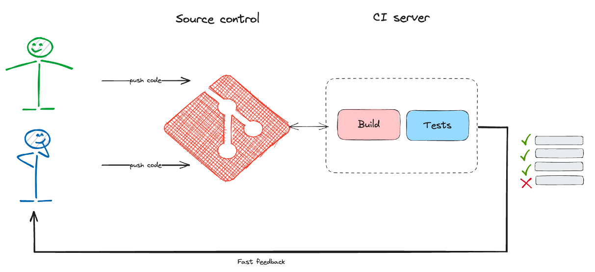
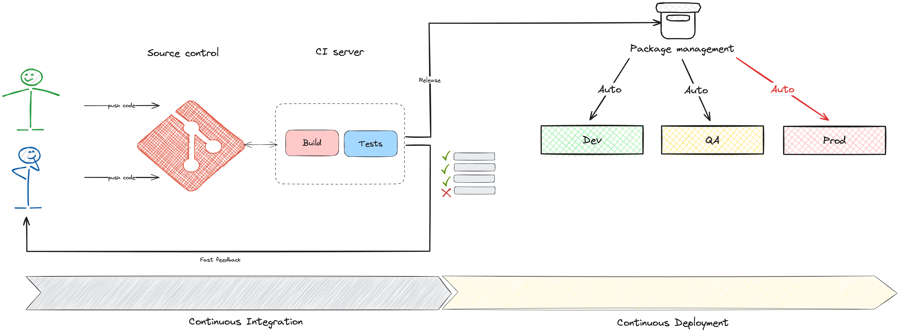

# Continous Integration (CI) & Continous Delivery (CD)

## Continuous Integration

Continuous Integration (CI) ist ein Entwicklungsprozess, bei dem Entwickler ihre Codeänderungen häufig in ein gemeinsames Repository hochladen, wo sie automatisch erstellt und getestet werden. Die Hauptziele der CI sind die Fehlererkennung schnell und die Bereitstellung von Software zu vereinfachen.

## Continuous Delivery

## Continuous Deployment
