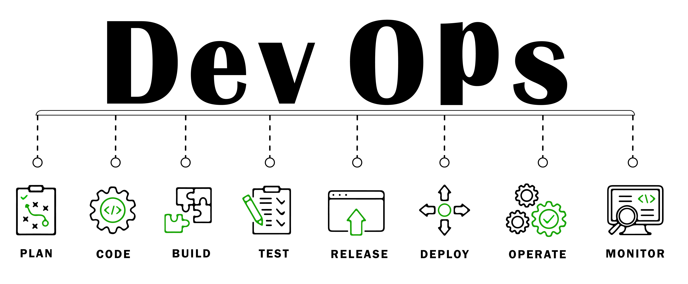

# DevOps:

DevOps ist eine Kultur und Praktik, die auf den Prinzipien von Continuous Integration, Continuous Delivery, Automation, Lean, Measurement und Sharing (CALMS) basiert. Diese Prinzipien helfen dabei, die Zusammenarbeit zwischen Entwicklung (Development) und Betrieb (Operations) zu verbessern und die Softwarebereitstellung effizienter zu gestalten.

## Wasserfall -> Agile -> DevOps

### Wasserfall

Das Wasserfallmodell ist ein lineares Vorgehensmodell, bei dem das Projekt in Phasen organisiert wird. Die Phasen werden sequentiell durchlaufen und bauen aufeinander auf. Das Wasserfallmodell ist ein klassisches Vorgehensmodell, das in den 1970er Jahren entwickelt wurde. Es ist das erste dokumentierte Vorgehensmodell und diente als Grundlage für viele weitere Vorgehensmodelle.

#### Vorteile
- Einfach zu verstehen
- Einfach zu verwalten
- Einfach zu planen
- Einfach zu kontrollieren
- Einfach zu messen

#### Nachteile
- Keine Flexibilität
- Keine Anpassungsfähigkeit
- Keine schnelle Reaktion auf Änderungen
- Keine schnelle Fehlerbehebung

### Agile

#### Die Leitsätze des Agilen Manifests:
1. Fokus mehr auf Individuen und Interaktionen, weniger auf Prozessen und Werkzeugen
2. Funktionierende Software ist wichtiger als umfangreiche Dokumentation
3. Zusammenarbeit mit Kunden wird Vertragsverhandlungen vorgezogen
4. Anpassungsfähigkeit hat Vorrang vor striktem Festhalten an Plänen

### DevOps

#### Vorteile
- Schnellere Bereitstellung
- Höhere Qualität
- Höhere Zuverlässigkeit
- Höhere Sicherheit
- Höhere Kundenzufriedenheit
- Höhere Mitarbeiterzufriedenheit
- Höhere Effizienz

#### Nachteile
- Komplexität
- Lernkurve
- Kulturelle Veränderungen
- Veränderungen in der Organisation
- Veränderungen in der Technologie
- Veränderungen in den Prozessen
- Veränderungen in den Tools
- Veränderungen in der Kommunikation
- Veränderungen in der Zusammenarbeit
- Veränderungen in der Verantwortung
- Veränderungen in der Transparenz

## Komplexität

## Historie

> “It is not the strongest or the most intelligent who will survive but those who can best adapt to change.” Leon C. Megginson

> “DevOps, a movement of people who care about developing and operating reliable, secure, high performance systems at scale, has always — intentionally — lacked a definition or manifesto”. John Willis

### Referenzen und weiterführende Links

- [DevOps Days](https://devopsdays.org/)
- [10 Deploys Per Day: Dev and Ops Cooperation at Flickr](https://www.youtube.com/watch?v=LdOe18KhtT4)
- [Continuous Delivery: Reliable Software Releases through Build, Test, and Deployment Automation](https://www.goodreads.com/book/show/8686650-continuous-delivery)
- [State of DevOps Report](https://puppet.com/resources/report/state-of-devops-report)
- [The DevOps Handbook: How to Create World-Class Agility, Reliability, and Security in Technology Organizations](https://www.goodreads.com/book/show/26083308-the-devops-handbook)
- [Accelerate: The Science of Lean Software and DevOps: Building and Scaling High Performing Technology Organizations](https://www.goodreads.com/book/show/39080433-accelerate)
- [The Phoenix Project: A Novel about IT, DevOps, and Helping Your Business Win](https://www.goodreads.com/book/show/17255186-the-phoenix-project)
