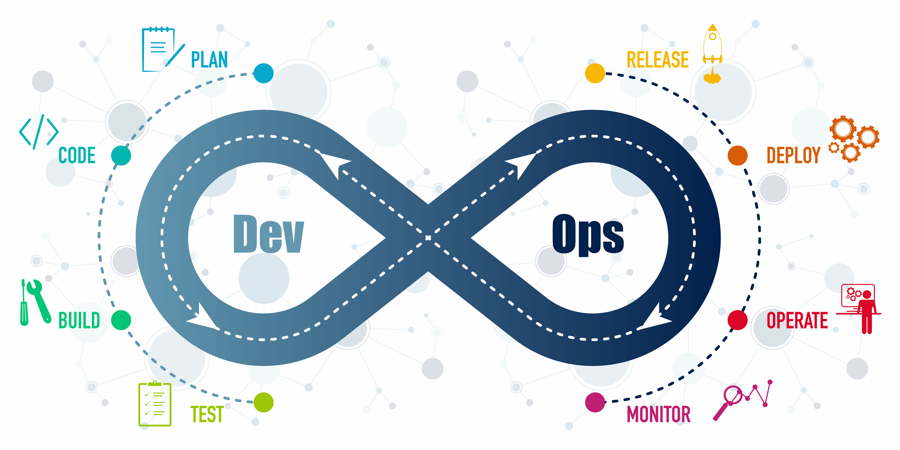

# DevOps: 

DevOps ist eine Kultur und Praktik, die auf den Prinzipien von Continuous Integration, Continuous Delivery, Automation, Lean, Measurement und Sharing (CALMS) basiert. Diese Prinzipien helfen dabei, die Zusammenarbeit zwischen Entwicklung (Development) und Betrieb (Operations) zu verbessern und die Softwarebereitstellung effizienter zu gestalten.

## Wasserfall vs. DevOps

## Komplexität

## Historie

Zitat: “It is not the strongest or the most intelligent who will survive but those who can best adapt to change.” Leon C. Megginson

Zitat: “DevOps, a movement of people who care about developing and operating reliable, secure, high performance systems at scale, has always — intentionally — lacked a definition or manifesto”. John Willis 

### Referenzen und weiterführende Links

- [The Three Ways: The Principles Underpinning DevOps](https://itrevolution.com/the-three-ways-principles-underpinning-devops/)
- [DevOps at Microsoft](https://learn.microsoft.com/en-us/devops/)
- [CALMS: The DevOps Culture Model](https://www.atlassian.com/devops)

//TODO: Slides einfügen
Slides:
Einführung:
10 - 15 Wasserfall vs. DevOps
16 - 23 Komplexität

