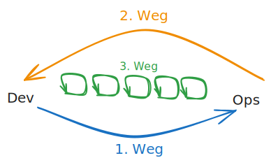
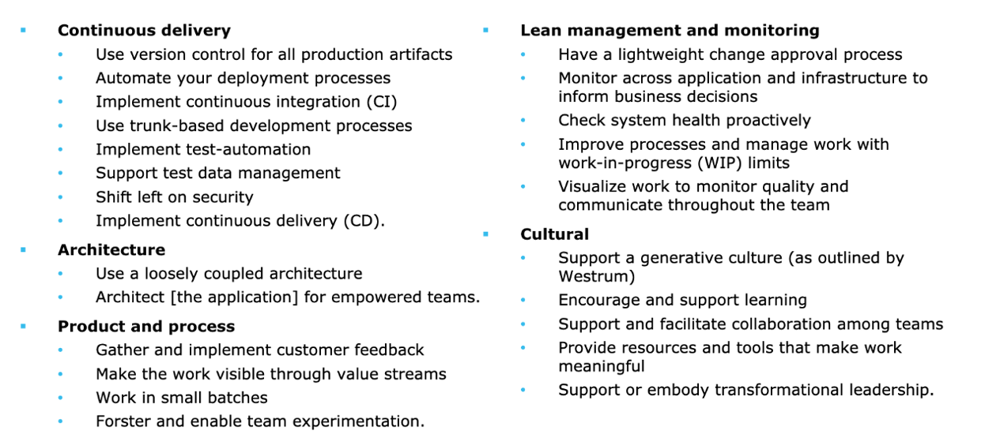

# Fortgeschritten

## Lifecycle

## CALMS

- **C**ulture
- **A**utomation
- **L**ean
- **M**easurement
- **S**haring

## Die 3 Wege von DevOps

**Der Erste Weg: Systemdenken**
   - Verstehen des gesamten Systems und der Auswirkungen von Entscheidungen auf das Gesamtsystem.
   - Fokus auf den End-to-End-Fluss der Arbeit.

**Der Zweite Weg: Amplify Feedback Loops**
   - Schnelles Feedback ermöglichen, um schnelle Anpassungen vornehmen zu können.
   - Einführung von Feedbackschleifen an allen Stellen des Entwicklungs- und Bereitstellungsprozesses.

**Der Dritte Weg: Experimente und Lernen fördern**
   - Mut zur Innovation und Experimentation.
   - Lernen aus Fehlern und kontinuierliche Verbesserung.

## PPT (People, Process, Technology)
Zitat: “DevOps at a very high-level involves People, Process, and Products/Tools – and in that order intentionally.” John Willis

## 24 Key Caps

### Referenzen und weiterführende Links

