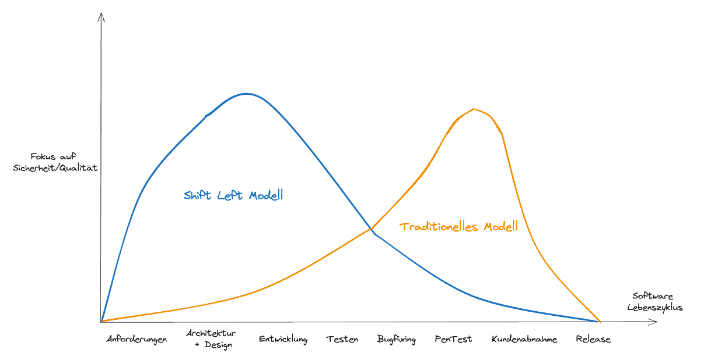
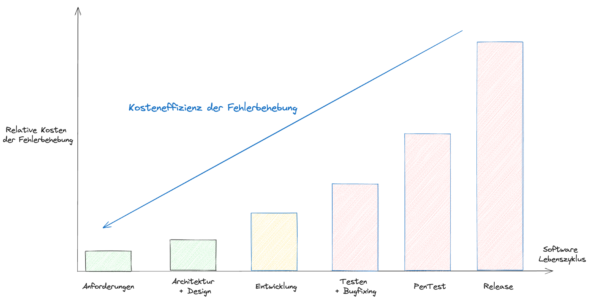
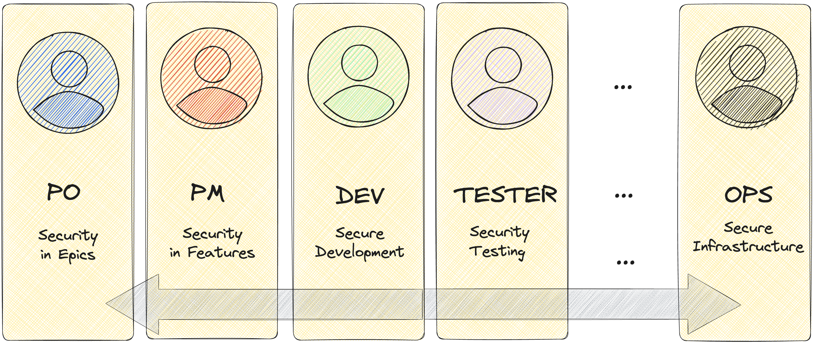

# Integration von Security in DevOps

## Shift Left
- Reduziertes Risiko von Sicherheitsverletzungen
- Verkürzte Entwicklungsdauer durch frühzeitige Fehlerbehebung
- Optimierung der Teamzusammenarbeit
- Ehöhte Kundenzufriedenheit und mehr Vertrauen durch sichere Produkte

## Vorteile
- Früherkennung von Sicherheitslücken
- Schnellere Reaktion auf Sicherheitsbedrohungen
- Reduzierung von Sicherheitsrisiken und -kosten
- Förderung der Zusammenarbeit zwischen Teams
- Automatisierung von Sicherheitsmaßnahmen

## Herausforderungen
- Geschwindigkeit und Druck für schnelle Bereitstellungen
- Kulturelle Unterschiede zwischen Entwicklungs- und Sicherheitsteams
- Werkzeug- und Prozessintegration
- Komplexität der Anwendungsarchitekturen
- Schulung und Kompetenzentwicklung
    - [Security Certification Roadmap](https://pauljerimy.com/security-certification-roadmap/)

### Verantwortlichkeiten

### Referenzen und weiterführende Links
- [Shift Left Security by snyk](https://snyk.io/learn/shift-left-security/)
- [Shift Left Security by apisec](https://www.apisec.ai/blog/shift-left-security)