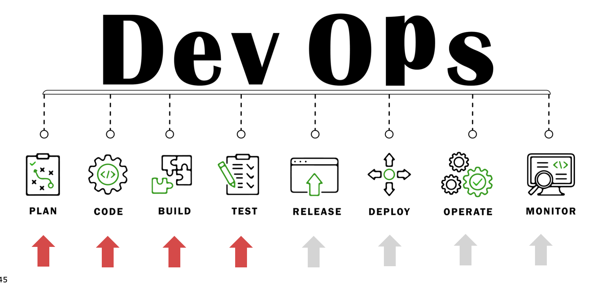
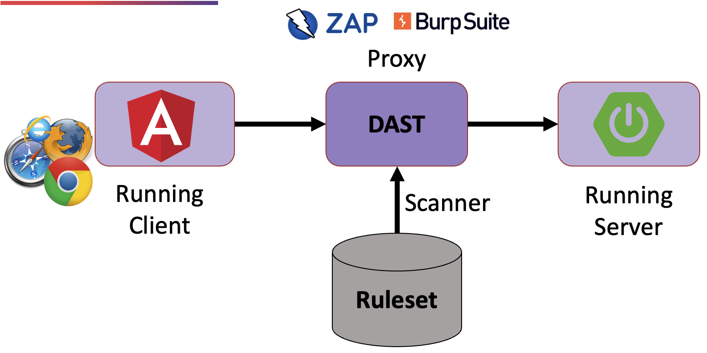
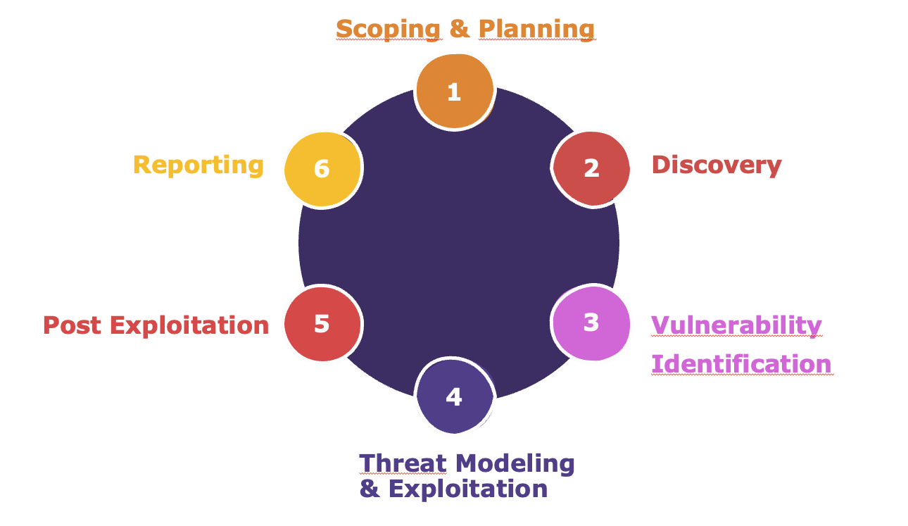

# Anwendungssicherheit

## Planung

### Methoden zum Planen sicherer Anwendungen:

* Threat Modeling
  1. Anwendung zerlegen
  2. Bestimmen Sie Vermögenswerte und Sicherheitsziele
  3. Ermitteln Sie Bedrohungen
  4. Bedrohungen einstufen
  5. Bestimmen Sie Gegenmaßnahmen und Schadensbegrenzung

## Coden

### Sichres Design: Die wichtigsten Sicherheitsprinzipien
* Geringstes Privileg 
* Aufgabentrennung 
* Verteidigung in der Tiefe 
* Sicher scheitern 
* Offenes Design 
* Sicherheit durch Dunkelheit vermeiden 
* Minimierung der Angriffsfläche

### Nützliche Ressourcen für Entwickler
[OWASP Web Security Top 10](https://owasp.org/www-project-top-ten/)

[OWASP API Security Top 10](https://owasp.org/API-Security/editions/2023/en/0x00-header/)

## Bauen & Testen

### ToDo's für jeden Layer der Pyramide

* Static Application Security Testing (SAST)
  

* Dynamic Application Security Testing (DAST)
  

* Security Tools für die CI-/CD-Pipeline
  

* Code Reviews

* Pentests
  

* Software Composition Analysis (SCA)
  

### Nützliche Ressourcen für Entwickler
[OWASP Websecurity Testing Guide](https://owasp.org/www-project-web-security-testing-guide)

[OWASP Security-C4PO Anwendung](https://owasp.org/www-project-security-c4po/)