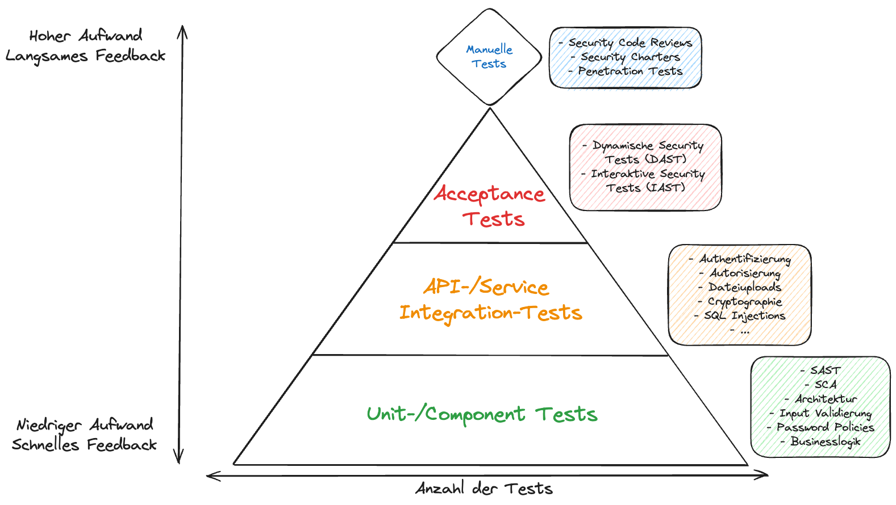
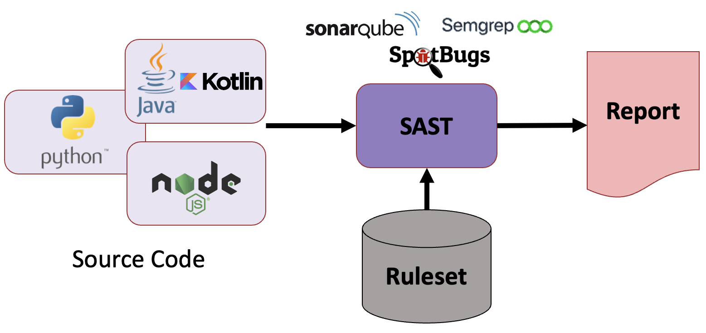
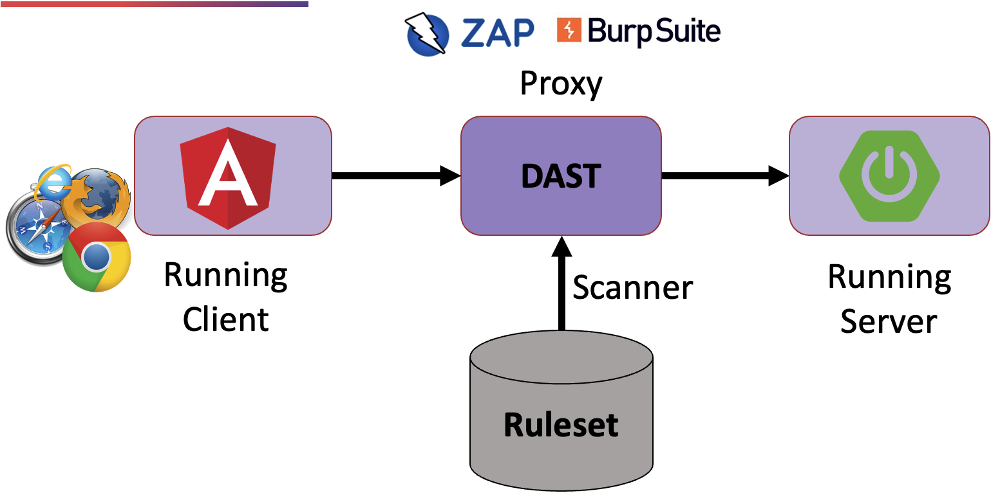
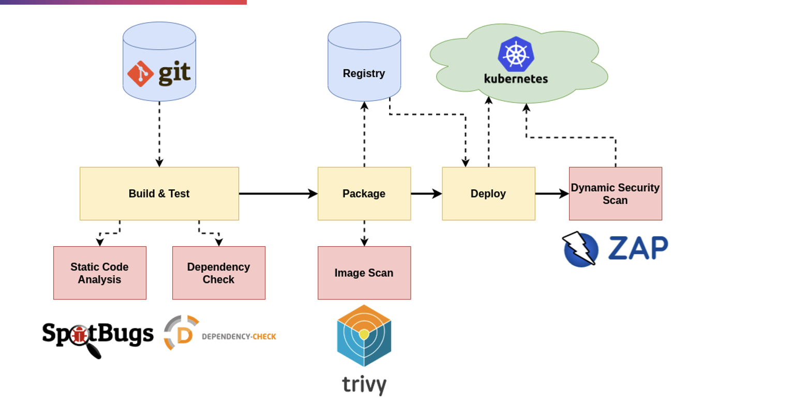
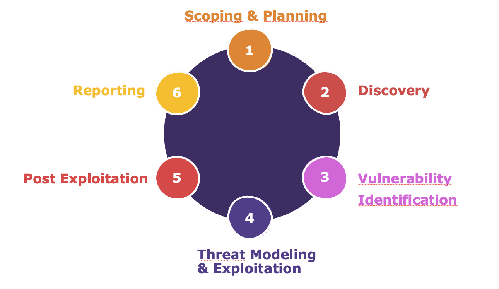
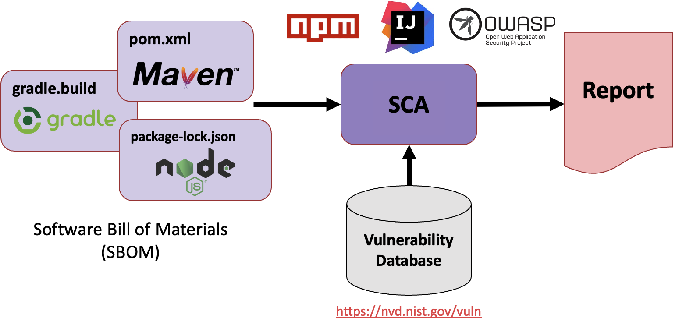
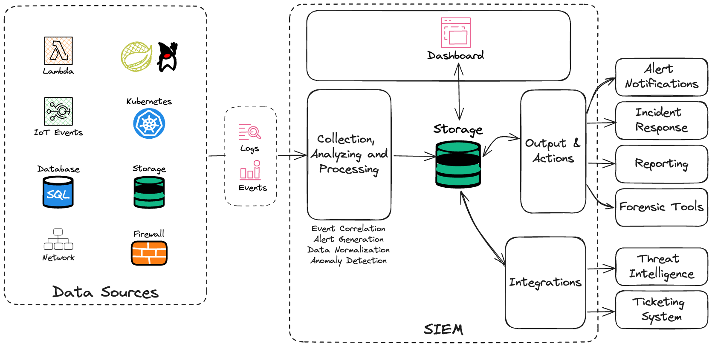

# Security Automatisierung

## Security Testing

### ToDo's für jeden Layer der Pyramide

* Static Application Security Testing (SAST)
  

* Dynamic Application Security Testing (DAST)
  

* Security Tools für die CI-/CD-Pipeline
  

Eine beispielhafte Pipeline mit GitHub Actions ist in diesem [Projekt](https://github.com/andifalk/supply-chain-security) zu finden.  

* Code Reviews

* Pentests
  

* Software Composition Analysis (SCA)
  

  

## Security Observability

Um jederzeit auskunftsfähig bezüglich der Sicherheit aller Anwendungen und Umgebungen zu sein werden entsprechende Protokollierungen und ein Monitoring benötigt.

Heute moderne Observability Systeme beinhalten meist ein SIEM (Security Information and Event System).  
Mit diesem werden alle damit verbundenen Logs, Metriken und Ereignisse verknüpft so dass das SIEM mit Hilfe von Künstlicher Intelligenz und Machine Learning automatisiert Angriffspatterns erkennen kann.  Darüber hinaus sind damit dann auch (semi-)automatische Reaktionsmöglichkeiten verbunden.

