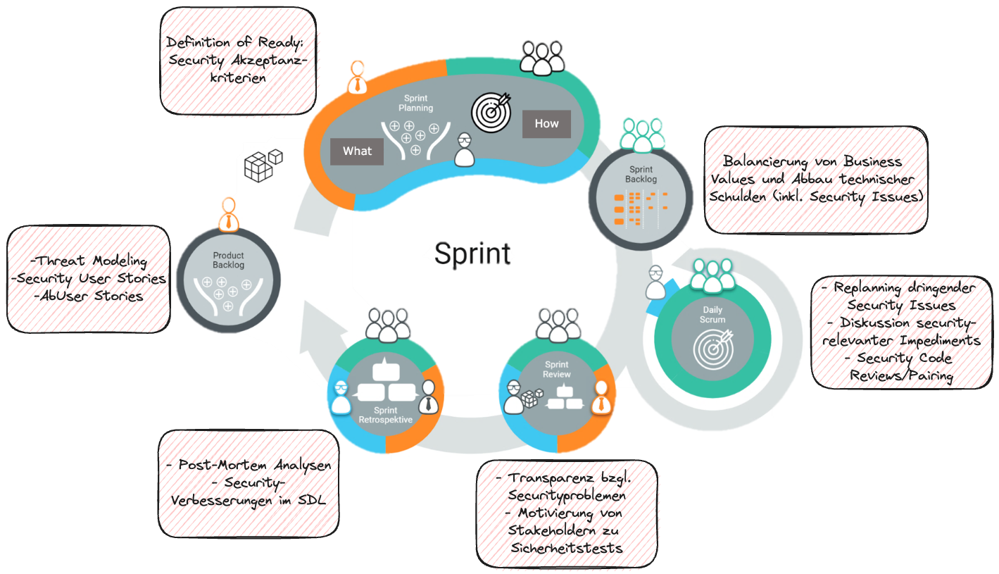

# Security Culture

## Allgemeines

- Bewusstsein schaffen: Sensibilisierung aller Mitarbeiter für Sicherheitsaspekte.
- Integration in Unternehmenswerte: Sicherheit als integraler Bestandteil der Unternehmenskultur.
- Kontinuierliche Schulung: Regelmäßige Weiterbildung für aktuelle Sicherheitspraktiken.

## Security Champions

- Interne Botschafter: Ausgewählte Mitarbeiter fördern die Security Kultur intern.
- Experten und Ressourcen: Unterstützen Teams als Sicherheitsexperten und Ressourcen.

