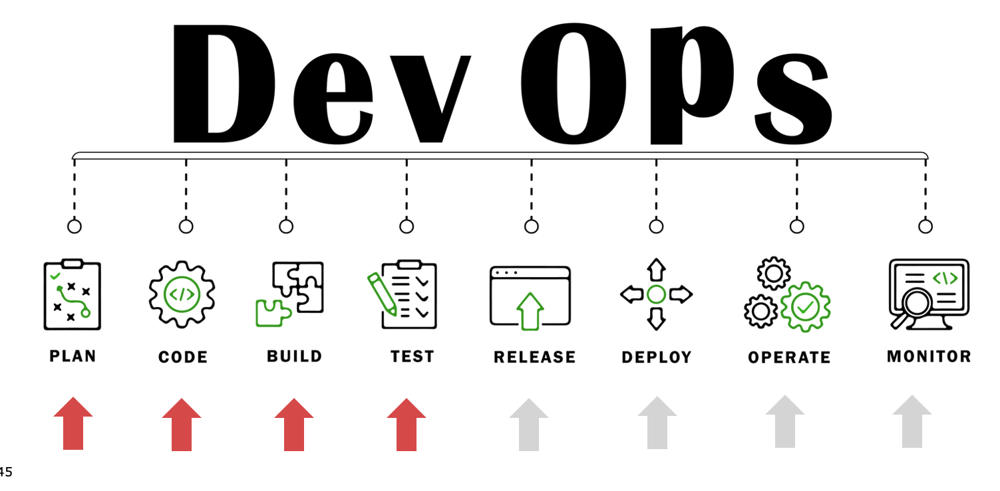
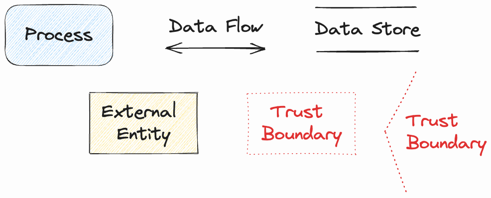
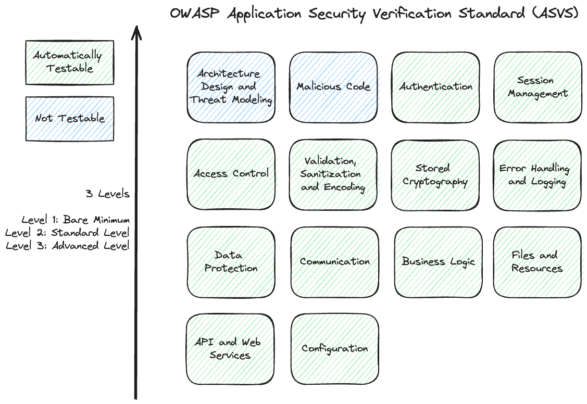

# Security (in DevOps)

Sicherheit sollte nach der _Shift-Left-Security_ Analogie heute im gesamten Softwarelebenszyklus (SDLC) verankert sein.

Die wesentlichen Teile eines SDLC sind in der nachfolgenden Abbildung zu sehen.

## Anforderungen für Security

Konkrete Anforderungen für Sicherheit sind häufig genauso schwierig zu definieren wie z.B. Performanceaspekte (wie schnell soll die Anwendung sein?).

Um hier zu konkreten Sicherheitsanforderungen zu gelangen gibt es zwei Methoden, die in den nächsten Abschnitten vorgestellt werden.

### Threat Modeling

Mittels der Bedrohungsmodellierung (Threat Modeling) können frühzeitig potenzielle Bedrohungen, wie Schwachstellen oder die Möglichkeit von Angriffen, gegen ein System oder eine Anwendung systematisch identifiziert und bewertet werden. Ziel ist es, diese Bedrohungen zu verstehen um Maßnahmen zu ergreifen, die das Risiko von Sicherheitsverletzungen verringern.

Die Bedrohungsmodellierung wird in de nachfolgend beschriebenen Schritten durchgeführt:

1. __Erstellung eines Abbilds über das System__ (_What are we working on?_):
Mit Hilfe geeigneter Diagramme wie z.B. mit einem Datenflussdiagram wird visualisiert, wie das System aufgebaut ist und wie Daten über diverse Übertragungsprotokolle durch das System fließen.
2. __Identifikation von Bedrohungen und Schwachstellen__ (_What can go wrong?_):
Auf Basis des Systemabbilds werden im zweiten Schritt potenzielle Bedrohungen und Schwachstellen ermittelt. Dies erfolgt mit unterschiedlichen Methoden wie z.B. der STRIDE Methode.
3. __Definition und Umsetzung von Gegenmaßnahmen und Strategien zum Umgang mit den Bedrohungen und Schwachstellen__ (_What are we going to do about it?_):
Für jede der gefundenen Bedrohungen und Schwachstellen müssen dann Sicherheitsmassnahmen definiert und umgesetzt werden um die damit verbundenen Risiken zu mindern.
4. __Retrospektive__ (_Did we do a good enough job?_):
Im letzten Schritt wird geprüft, ob das Threat Model vollständig ist und alle wesentlichen Risiken erkannt und behandelt wurden. Darüber hinaus wird laufend die Effizienz des Threat Modeling Prozesses überprüft.

Ein Datenflussdiagramm ist aus sehr einfachen Elementen aufgebaut, die in der nachstehenden Abbildung ersichtlich sind.

### Application Security Verification Standard (OWASP)

Mit Hilfe von ASVS bekommt man einen umfassenden Katalog immer wieder relevanten Anforderungen für Security an die Hand.  
Je nach erforderlichem Sicherheitslevel sollten die in diesem Guide aufgeführten Anforderungen von typischen Anwendungen erfüllt werden.  

Die meisten aufgeführten Anforderungen können durch automatisierte Tests anhand der aufgeführten Akzeptanzkriterien abgedeckt werden.

## Sichere Architektur und Designprinzipien

* Geringstes Privileg (Least Privilege)
* Aufgabentrennung (Seperation of Concerns)
* Verteidigung in der Tiefe (Defense in Depth)
* Sicher scheitern (Fail securely)
* Offenes Design (Open Design)
* Sicherheit durch Dunkelheit vermeiden (No security by obscurity)
* Minimierung der Angriffsfläche (Reduce attack surface)

## Secure Coding

* Eingabevalidierung
* Ausgabecodierung
* Sparsame Fehlermeldungen
* Logging und Tracing
* Vermeidung unsicherer APIs

### Referenzen und weiterführende Links

* [Threat Modeling Manifesto](https://www.threatmodelingmanifesto.org/)

* [OWASP ASVS](https://github.com/OWASP/ASVS)

* [OWASP Web Security Top 10](https://owasp.org/www-project-top-ten/)

* [OWASP API Security Top 10](https://owasp.org/API-Security/editions/2023/en/0x00-header/)

* [OWASP Websecurity Testing Guide](https://owasp.org/www-project-web-security-testing-guide)

* [OWASP Security-C4PO Anwendung](https://owasp.org/www-project-security-c4po/)