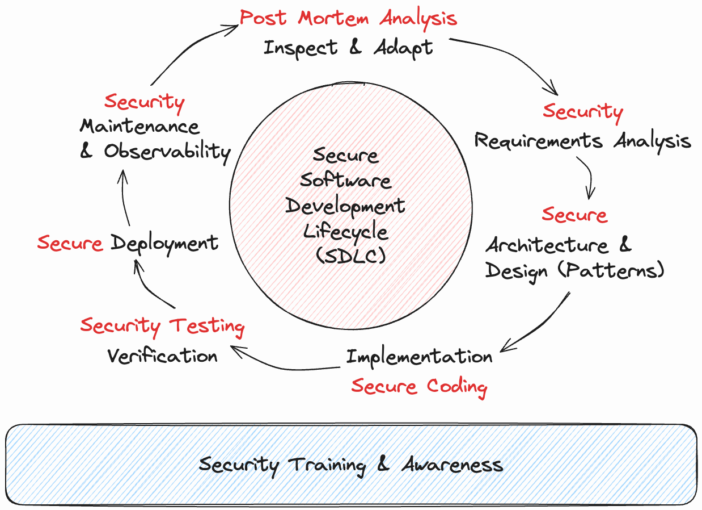
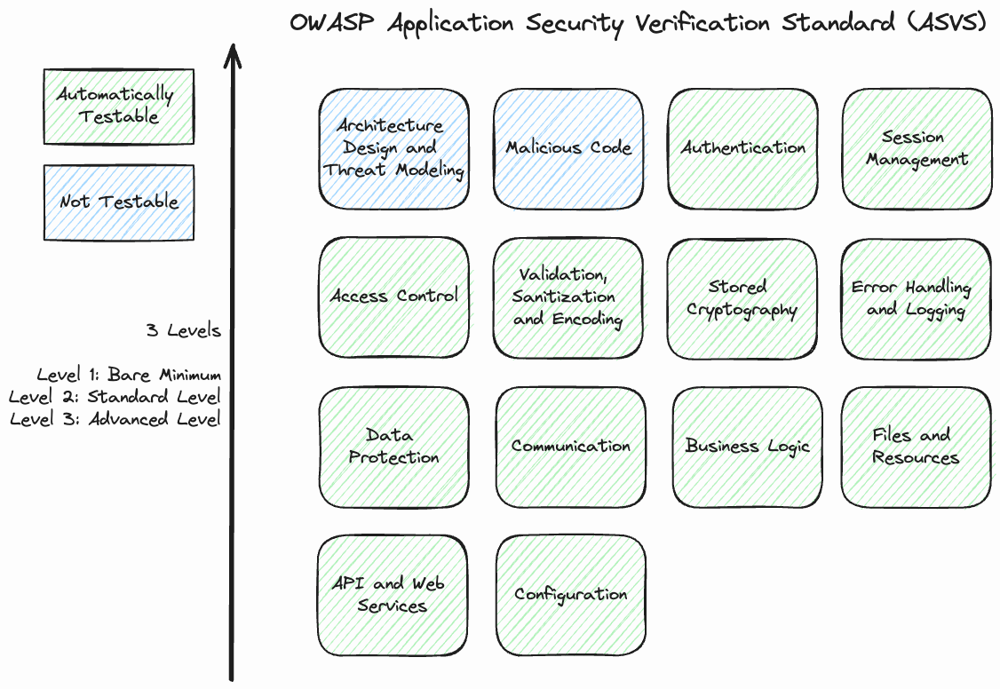
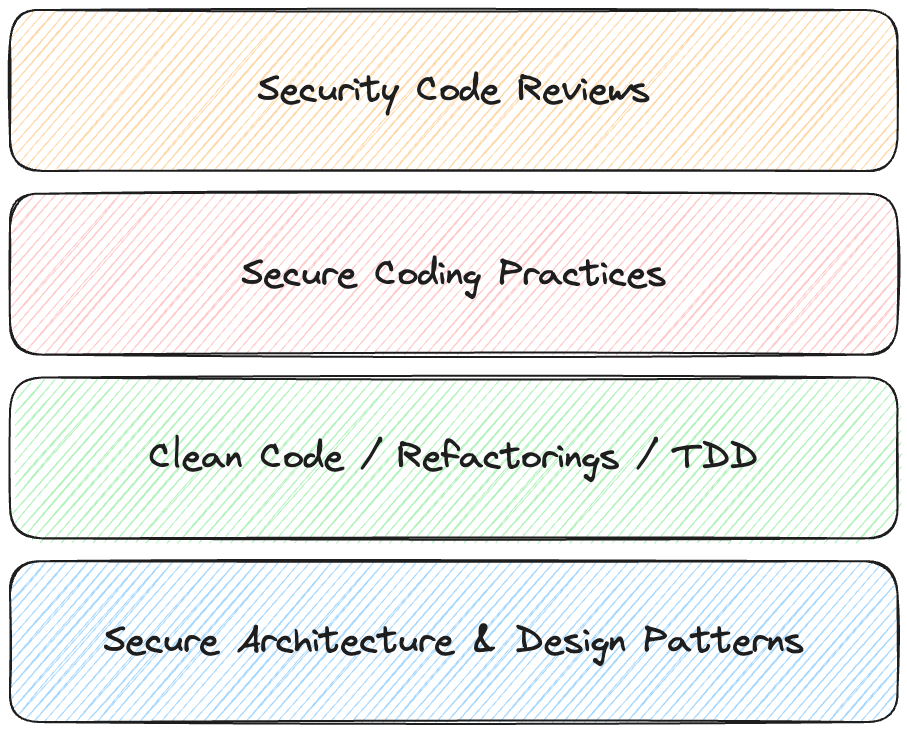

# Security (in DevOps)

## Anforderungen für Security

### Threat Modeling

Mittels der Bedrohungsmodellierung (Threat Modeling) können frühzeitig potenzielle Bedrohungen, wie Schwachstellen oder die Möglichkeit von Angriffen, gegen ein System oder eine Anwendung systematisch identifiziert und bewertet werden. Ziel ist es, diese Bedrohungen zu verstehen um Maßnahmen zu ergreifen, die das Risiko von Sicherheitsverletzungen verringern.

Die Bedrohungsmodellierung wird in de nachfolgend beschriebenen Schritten durchgeführt:

1. __Erstellung eines Abbilds über das System__ (_What are we working on?_):
Mit Hilfe geeigneter Diagramme wie z.B. mit einem Datenflussdiagram wird visualisiert, wie das System aufgebaut ist und wie Daten über diverse Übertragungsprotokolle durch das System fließen.
2. __Identifikation von Bedrohungen und Schwachstellen__ (_What can go wrong?_):
Auf Basis des Systemabbilds werden im zweiten Schritt potenzielle Bedrohungen und Schwachstellen ermittelt. Dies erfolgt mit unterschiedlichen Methoden wie z.B. der [STRIDE]() Methode.
3. __Definition und Umsetzung von Gegenmaßnahmen und Strategien zum Umgang mit den Bedrohungen und Schwachstellen__ (_What are we going to do about it?_):
Für jede der gefundenen Bedrohungen und Schwachstellen müssen dann Sicherheitsmassnahmen definiert und umgesetzt werden um die damit verbundenen Risiken zu mindern.
4. __Retrospektive__ (_Did we do a good enough job?_):
Im letzten Schritt wird geprüft, ob das Threat Model vollständig ist und alle wesentlichen Risiken erkannt und behandelt wurden. Darüber hinaus wird laufend die Effizienz des Threat Modeling Prozesses überprüft.

### Application Security Verification Standard

## Sichere Architektur und Designprinzipien

## Secure Coding

### Referenzen und weiterführende Links

- [Threat Modeling Manifesto](https://www.threatmodelingmanifesto.org/)
- [OWASP ASVS](https://github.com/OWASP/ASVS)
- [CALMS: The DevOps Culture Model](https://www.atlassian.com/devops)
