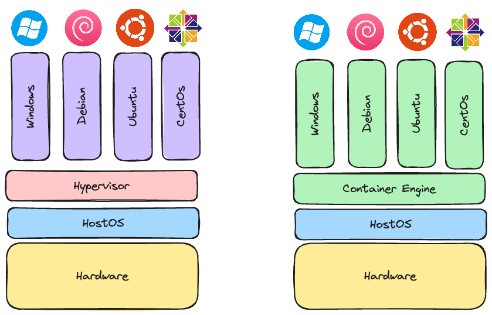
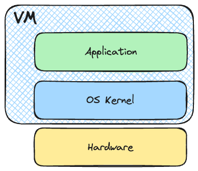
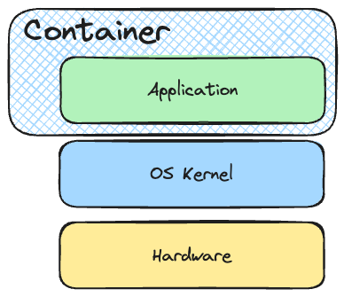
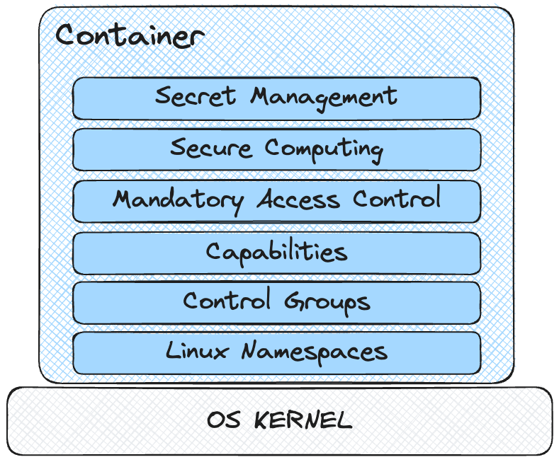

# Container

## Container Grundlagen

### Was ist ein Container?

Ein Container ist eine isolierte Umgebung, die eine Anwendung und alle ihre Abhängigkeiten enthält. Container teilen sich das Betriebssystem des Hosts, aber jede Container-Anwendung läuft isoliert im Benutzermodus.

### Container vs. VMs

### Virtual Machines

### Container

### Container Security

### Referenzen und weiterführende Links

- [Introduction to Containers](https://www.docker.com/resources/what-container)
- [Docker Documentation](https://docs.docker.com/)
- [Dockerfile Best Practices](https://docs.docker.com/develop/develop-images/dockerfile_best-practices/)
- [Docker Security Rootless](https://docs.docker.com/engine/security/rootless/)
- [Hadolint GitHub Repository](https://github.com/hadolint/hadolint)
- [Dive GitHub Repository](https://github.com/wagoodman/dive)
- [Docker Bench for Security GitHub Repository](https://github.com/docker/docker-bench-security)
- [Docker Security Cheat Sheet](https://cheatsheetseries.owasp.org/cheatsheets/Docker_Security_Cheat_Sheet.html)