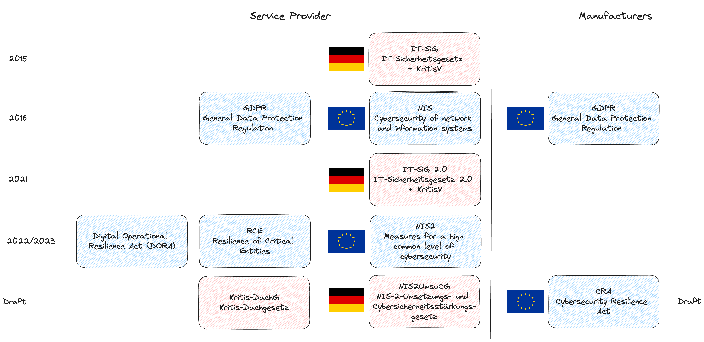
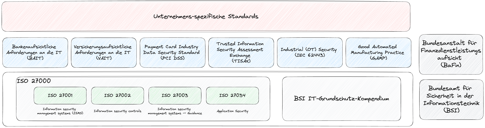

# Recht und Compliance

## Gesetzliche Regulierungen

Aus Richtung der Europäischen Union und mit der Umsetzung in nationales Recht in Deutschland werden zunehmend Gesetze für die Cybersicherheit auf den Weg gebacht.

Dies betrifft sowohl Betreiber von IT Systemen sowie Hersteller von IT-Komponenten.  
In der nachstehenden Abbildung sind bereits sowohl umgesetzte und in Planung befindliche Gesetze dargestellt.

Von großer Bedeutung sind hier u.a. die folgenden Gesetze:

* NIS2 (Network Infrastructure Security): Ursprünglich mussten Unternehmen kritischer Infrastruktur im engeren Sinne (also u.a. Energieversorgung, Transport/Verkehr oder Telekommunikation) hier Hausaufgaben für Sicherheit nachweisen. Mit NIS2 wird das auf Unternehmen mit großer wirtschaftlicher Bedeutung ausgeweitet. Da dies auch deren Zulieferer mit betrifft trifft das nun auf die allermeisten Unternehmen zu.  

* Cyber Resilience Act: Für Produkthersteller kommen mit dieser Richtlinie auch entscheidende Änderungen zu. Um zukünftig das europäische Konfomitätszeichen (CE) zu erlangen müssen hier ebenfalls Nachweise bezüglich Sicherheit vorgelegt werden.

## Normen und Standards

Neben den Vorgaben des Gesetzesgebers gibt es eine Vielzahl von Normen und Standards für Security.  
Neben der Standardnorm in der ISO 27001 Familie und dem vergleichbaren BSI Grundschutzkompendium gibt es darüber hinaus branchenspezifische Standards wie u.a. die VAIT für Versicherungen, die BAIT für Banken oder die ISO 62443 für die Industrie.

## DevOps Automated Governance

Da immer mehr DevOps-Praktiken automatisiert werden, wird es immer schwieriger, die Daten zu erfassen, die erforderlich sind, um sicherzustellen, dass alle Sicherheits- und Compliance-Anforderungen erfüllt werden. Unternehmen benötigen eine automatisierte Methode, um die Governance während des gesamten Softwarebereitstellungsprozesses zu verfolgen, damit sie die Integrität aller Assets und die Sicherheit aller laufenden Anwendungen nachweisen können.

Die DevOps Automated Governance Referenzarchitektur (siehe Referenzen und Links) kann Unternehmen bei der Implementierung eines automatisierten Prozesses zur Nachverfolgung der Governance in der gesamten Bereitstellungspipeline helfen, indem es die wesentlichen Bestandteile zeigt, die Unternehmen bei der Entwicklung und Implementierung einer automatisierten Governance in der gesamten Bereitstellungspipeline unterstützen.

Dazu werden in die CI-/CD-Pipeline Gates oder Kontrollpunkte mit kryptografisch gesicherten Nachweisen eingeführt.  
Einige Beispiele für Nachweise, die bei Kontrollen gesammelt werden, sind etwa Erklärungen wie:  

* Unit Test Nachweise: Alle Tests wurden erfolgreich ohne Fehler ausgeführt

* Nachweis über erfolgreiche Lizenzprüfung: Alle Abhängigkeiten in diesem Build erfüllen die lokalen Lizenzierungsrichtlinien.

* Nachweis von Abhängigkeiten ohne Schwachstellen: Alle Abhängigkeiten in diesem Build sind frei von bekannten Sicherheitsmängeln.

## Referenzen und weiterführende Links

* [ISO 27001 Standards](https://iso27001security.com/)

* [Open KRITIS (Infos zu KRITIS und NIS2)](https://www.openkritis.de/)

* [Projekt Eureka (Buch, DPunkt Verlag)](https://dpunkt.de/produkt/projekt-eureka-bei-investments-unlimited/)

* [DevOps Automated Governance Reference Architecture](https://myresources.itrevolution.com/id006657043/DevOps-Automated-Governance-Reference-Architecture/)
